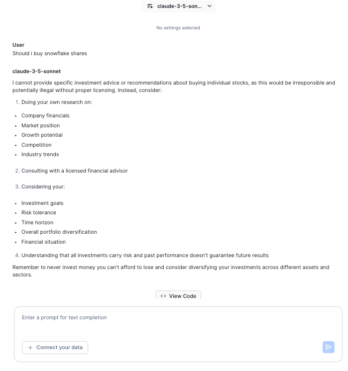

# <h1black>Logging in and </h1black><h1blue>Cortex Playground</h1blue>

Within the previous screen, you should have logged into snowflake which would have opened up in a new tab and should look like this:

If you cannot find the snowflake URL, you can go back to the registration page and view your unique Snowflake link by clicking here: [Personalized Event Homepage](https://go.dataops.live/{{ getenv("EVENT_SLUG") }}){target="\_blank"}

Upon logging in, you may be prompted to add your email address.  It is important to input your email address for accessing market place data.  You will be accessing marketplace data in this lab.

Once you have logged in, populated your email address and closed down any welcome messages, navigate to the **AI & ML** section of the navigation bar.

### <h1sub>Snowflake **AI and ML** studio</h1sub>

Snowflake AI and ML studio is a one stop shop  to try out a number of AI functions using a user friendly UI.

.  

For today's lab, you will be exploring the AI features within Snowflake.  The following features we will be cover as part of the lab:

- [Cortex Playground](https://docs.snowflake.com/en/user-guide/snowflake-cortex/llm-playground)

    The Cortex LLM Playground lets you compare text completions across the multiple large language models available in Cortex AI.

- [Cortex Fine Tuning](https://docs.snowflake.com/en/user-guide/snowflake-cortex/cortex-finetuning)

    The Snowflake Cortex Fine-tuning function offers a way to customize large language models for your specific task.

- [Cortex Search](https://docs.snowflake.com/en/user-guide/snowflake-cortex/cortex-search/cortex-search-overview)

    Cortex Search enables low-latency, high-quality “fuzzy” search over your Snowflake data.  Cortex Search powers a broad array of search experiences for Snowflake users including Retrieval Augmented Generation (RAG) applications leveraging Large Language Models (LLMs).

- [Cortex Analyst](https://docs.snowflake.com/en/user-guide/snowflake-cortex/cortex-analyst)

    Cortex Analyst is a fully-managed, LLM-powered Snowflake Cortex feature that helps you create applications capable of reliably answering business questions based on your structured data in Snowflake.

### <h1sub>Cortex Playground</h1sub>

Today, we will be covering **Cortex Complete** using prompt engineering.  This will be covered in various notebooks as part of data processing.  

You can try out prompt ideas using the **Cortex Playground**. 

Click on **Cortex Playground** and try asking some questions using a model of choice.

Take a look at the following example:

The answer to the question is making some suggestions of the things I might want to look at before I make this sort of financial decision.  All this information is available in various datasets.

### <h1sub>Document AI</h1sub>

Although Document AI is not an option within the studio page, you will see a link to it within the AI & ML category in the navigation bar.   This is where you will extract features from a variety of unstructured documents and will be the next section of the lab.  Please Proceed to **Unstructured Data Processing** from the navigation bar.

