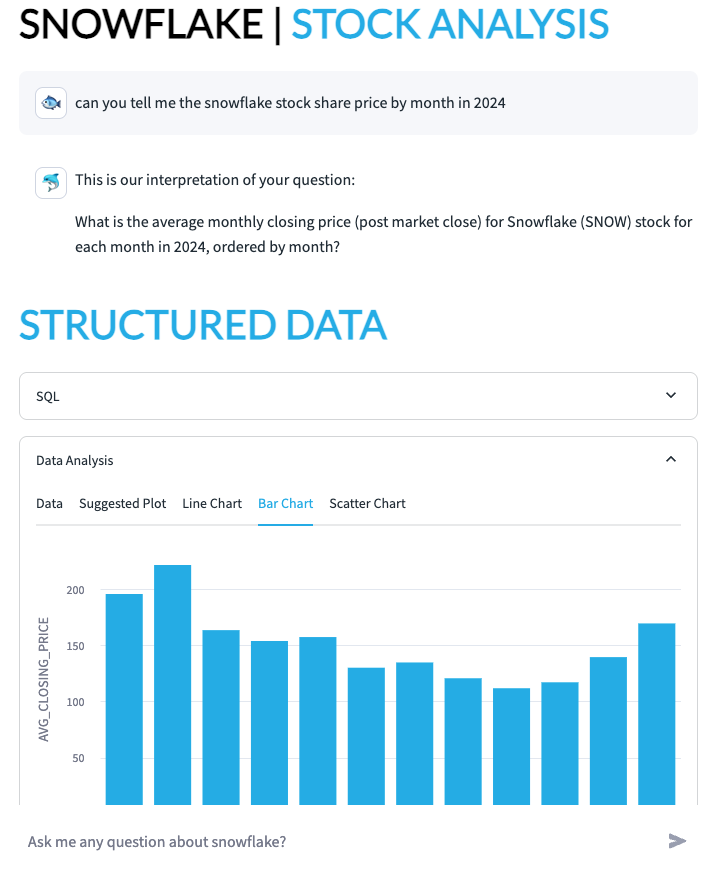

# <h1black>Create a </h1black><h1blue>Cortex Agent</h1blue>


We now have datasets in both structured and unstructured format.  Lets see how a **Cortex Agent** will allow users to ask questions about their data all in one place.  

If you have completed all the previous steps then this step should **just work**.

This streamlit app had been heavily styled.  Streamlit supports stylesheets allowing you to create a highly formatted application as you see fit.

Within **Projects>Streamlits** click on the notebook **CORTEX_AGENT**

Ask questions about the data that might appear in the earnings calls or analyst reports.

As questions about the data that might appear in the stock data or the latest infographics.


#### <h1h1sub> Sample Questions</h1h1sub>

These questions should give answers from both **unstructured** and **structured** examples using all the datasets we covered in this lab.

```
what analyst gave a rating of sell?

Give me a summary about Eclipse Capital's Analysis?

What analyst gave a rating of buy?

What did Horizon Investment Research say about Growth?

what are the latest SNOW stock prices over time in the last 12 months?

how many market place listings are in the latest report?

Tell me about dynamic tables?

shall i buy snowflake shares?

```

If you completed the optional excercise in cortex analyst, this is the response you will get if you ask what transcript had the lowest sentiment:


If you joined the logical table to cortex search, this is what you might bet if you later ask the question

**can you give me more information about that particular earnings call**


So you should see how convenient it is to bring in both the processing of structured datasets and structured datasets to get one holistic view of the data subject (in this case the analysis of snowflake) in question.


