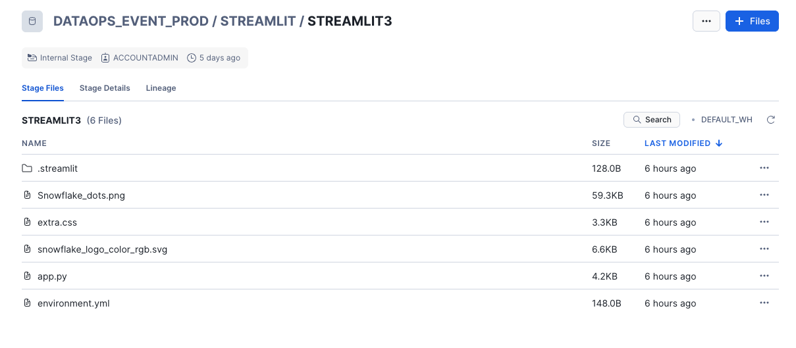

# <h1black>Create a </h1black><h1blue>Cortex Agent</h1blue>


You now have datasets in both structured and unstructured format.  Lets see how a **Cortex Agent** will allow users to ask questions about their data all in one place.  

If you have completed all the previous steps then this step should **just work**.

This Streamlit app had been heavily styled.  Streamlit supports stylesheets allowing you to create a highly formatted application as you see fit.  If you would like to view the style sheet as well as all other supporting files, you can by going to the dataops_event_prod database then downloading the files from **STREAMLIT > STREAMLIT3**




- Within **Projects>Streamlits** click on the notebook **CORTEX_AGENT**

Ask questions about the data that might appear in the earnings calls or analyst reports.

As questions about the data that might appear in the stock data or the latest infographics.


#### <h1sub> Sample Questions</h1sub>

These questions should give answers from both **unstructured** and **structured** examples using all the datasets we covered in this lab.

```
what analyst gave a rating of sell?

Give me a summary about Eclipse Capital's Analysis?

What analyst gave a rating of buy?

What did Horizon Investment Research say about Growth?

what are the latest SNOW stock prices over time in the last 12 months?

how many market place listings are in the latest report?

Tell me about dynamic tables?

shall i buy snowflake shares?

```

If you completed the optional exercise in cortex analyst, this is the response you will get if you ask what transcript had the lowest sentiment:


If you joined the logical table to cortex search, this is what you might get if you later ask the question:

**Can you give me more information about that particular earnings call**


So you should see how convenient it is to bring in both the processing of unstructured datasets and structured datasets to get one holistic view of the data subject (in this case the analysis of Snowflake) in question.


#### <h1sub> Editing the Application</h1sub>

Your role in this setup allows you to edit the application.  

- Press **Edit** to go into edit mode.


You will notice that the sementic model has been specified as well as the search service - which is what you created earlier.

You will notice a series of functions such as:

- **run_snowflake_query**

    This calls the built in agent api - and will treat the question differently depending on the context.  For instance, if the answer relates to structured data, it will use the tool spec **analyst1** which will attempt to turn the question into a sql query and will use the yaml file which you created in **Cortex Analyst**.  If however, the answer can only be found from unstructured data, it will use the tools spec **cortex_search** which will then use the search service to retrieve the information.  It will also retrieve up to 10 citations - these will be the chunked text which were extracted earlier on in the lab.

- **process_sse_response**

    This is about parsing the results in something readable as the original response will be a json payload

- **execute_cortex_complete_sql**

    This uses the LLM to attempt to create a chart based on what is in the dataset.  The type of LLM is defined using the **model** variable.

- **extract_python_code**

    This is used to return the python result (which will be a streamlit chart) into executable code.

- **replace_chart_function**

    This uses the same variables created for the suggested chart but allows for alternative streamlit charts.

- **def main**

    This is the initial (parent) function which is executed first and calls the other functions when appropiate. 

If you would like to make any changes to this application, you will need to **duplicate it**.  This is because the streamlit app is managed by an external application.

If you duplicate the application using the duplicate button, all files associated to the application will be copied with it.


### <h1sub> Alternative Agent </h1sub>

Take a look at the configurable alterative agent app - **CORTEX_AGENT_ALTERNATIVE**.  This app has an alternative approach for styling.  It leverages **streamlit extras** which has packaged in styles to customise your app.  It also allows you to choose the search service and analyst semantic model during the app configuration.  It also has a lot more configurable options for the user such as multiple chart types using **Plotly**


### <h1sub> Conclusion </h1sub>

The Cortex Agent provides a unified way to query both structured and unstructured datasets, enabling users to gain insights from diverse data sources within a single application. By leveraging Streamlit’s customization capabilities and integrating Snowflake’s semantic model and search service, users can seamlessly retrieve information from earnings calls, analyst reports, stock data, and more. The built-in functions ensure efficient querying, data parsing, and visualization, making it easier to analyze financial and market trends.


