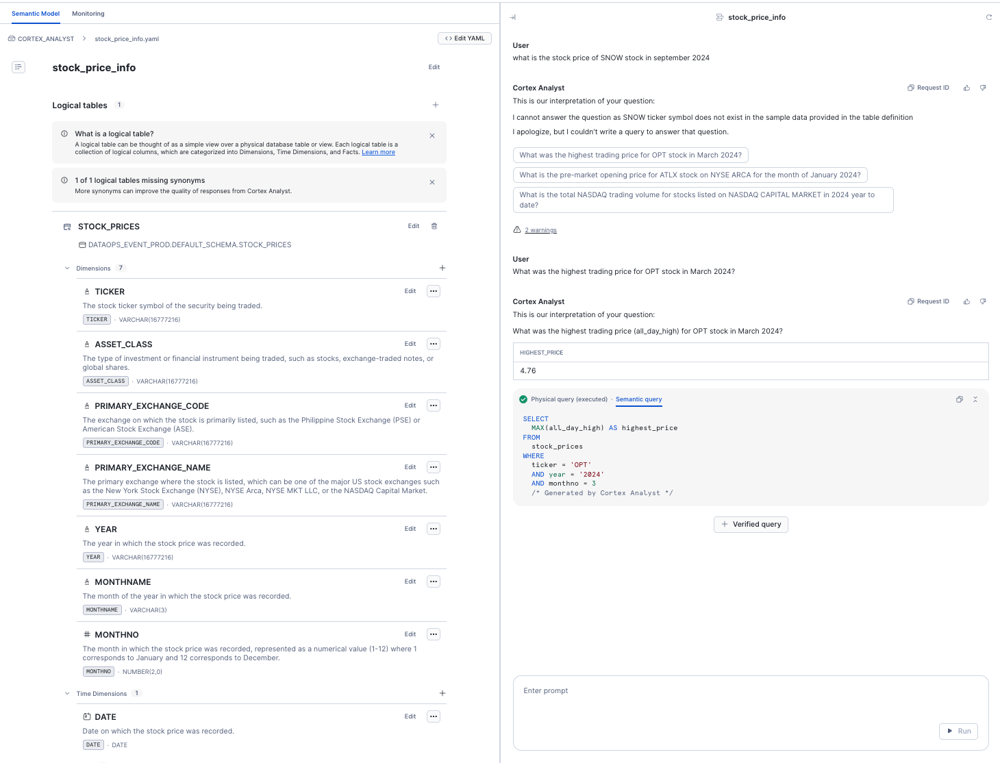

# <h1black>Analyse your data with</h1black> <h1blue>Cortex Analyst<h1blue>

In this section you will learn how to build a dynamic data explorer using Cortex Analyst.  Traditionally, users would digest structured information through reports.  Overtime, reports turned into dashboards and self service capabilities became more and more in demand.  However, in order to self serve, users would normally require extensive report buiding and data engineering expertise. 

Cortex Analyst's AI allows views to be generated by simply asking questions about the data


### <h1sub>Examine the Structured Marketplace Data</h1sub>

First of all, navigate to the Cortex Analyst notebook by navigating to the **projects > Notebooks**.

- Open the notebook and press Start in the top right hand corner to start the compute. 

Within the self contained notebook, you willperform the following:

-   Create a new dataset from the market place
-   Visualise the data in Streamlit

Once you have completed the notebook, return here

<hr>

### <h1sub>Use Cortex Analyst to Explore the data</h1sub>
It is easy to create an app in order to gain insights from structured data.  **Cortex Analyst** allows the user to ask questions in natural language and will return the result in an appropiate format.  Let's Begin:

- From the navigation bar on the right, hover over the **AI & ML** icon and click on **Studio**


- When prompted, end the notebook session to proceed.

- Press **Try** on **Cortex Analyst**.


Choose **DATAOPS_EVENT_PROD.CORTEX_ANALYST** as the schema and **CORTEX_ANALYST** as the stage

<hr>

- Press **Create New** to create a new Semantic model about the previously loaded dataset.

- Call the model **stock_price_info**.

Below you will see the **Semantic Model** wizard.  This will create a YAML file which makes sense of the data ane provides a link between the sorts of questions that might be asked and the dataset itself.  

- Populate the fields as the screenshot below:


- Press **Next**


- Under the **DATAOPS_EVENT_PROD.DEFAULT_SCHEMA** view, select the **STOCK_PRICES** table.
- Press **Next**
- Select all fields
- Press **Done**

Next, you will need to specify what fields are Dimensions, Time Dimensions, Facts, Named Fields or Metrics.  Cortex suggests where they should be placed - at this point, you have the ability to override where needed.

Under Named filters you can educate **Cortex** Analyst valid examples of how the data is filtered which improves the accuracy of the answers.  We will add one now

- Under **Named Filters** click on the +
- Under Expression, type in the following:

```sql
TICKER = 'SNOW'
```
- Under Filter name call the filter **SNOW**.
- Press **Generate Fields** to allow AI to ender a field description with synonyms.  You will see that Cortex assumes we are talking about 'Actual Snow' as apposed to a Data and AI platform. 
-   Modify the Synonyms to more relevant ones.  When finished, press **Save**

The next step you can provide sample questions of what might be asked about the dataset.  Tryout the following in the text box:

```text
What is the latest stock price for SNOW share?

Tell me the stock prices for SNOW Shares last week by day of the week?

What is the stock prices for SNOW shares by month?

```

As you try this out, you will see example outputs




- Press **Save** to save the YAML file which will be used in Streamlit


Continue to the next Cortex Analyst step.  We will refine the model to include an additional 2 tables...