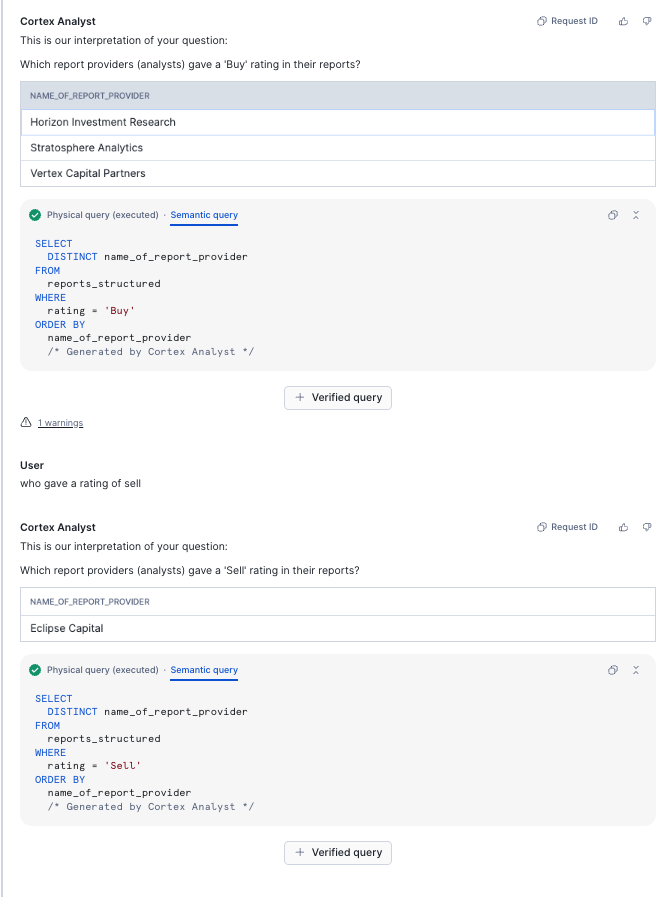

# CORTEX ANALYST - ADD MORE DATASETS

We have now created a **Semantec Model** for the structured dataset found on the market place.  If you remember, we parsed two additional datasets from document ai and created 2 additional structured tables.  We will add these additional tables into the semantic model.

- Within the **Snowflake AI and ML Studio**, click on **Cortex Analyst**
- Choose **DATAOPS_EVENT_PROD.CORTEX_ANALYST** for the Database and Schema
- Choose **Cortex Analyst** for the STAGE.
- Select the previously built yaml file.

- Press **Open**

Now we are in the edit screen.  You will see the existing setup - but now, we will add an additional table.

- Click on the **+** nedt to **Logical tables**.

- Under DATAOPS_EVENT_PROD.DOCUMENT_AI, select **EARNINGS_INFOGRAPHIC_PARSED**.

- Press **Next**

- Select all fields.

- Press **Done**

You can now browse through the Dimensions, Time dimensions and Facts to see if everything is as expected.  You have the opportunity to make amendmendmend and add **Synonyms** to each field

You can now test cortex analyst out from here.  For instance,

- In the prompt ask ** What is the product Revenue in 2023**

Cortex will Present you with an answer as well as a sample query.  If you think this is correct, you can add it as a **Verified Query**.

When you have finished editing the **Semantic Model** press **Save** which is at the top right hand corner of the screen.

- Add another **Logical Table** the same way as before.  This time, within **DATAOPS_EVENT_PROD.DOCUMENT_AI**, select **REPORTS_STRUCTURED**.

- Choose All columns and then click **Done**

- What analyst gave a rating of **Buy**?
- Who gave a rating of **Sell**?

    

- When you have finished refining the **Semantic Model** press **Save** which is on the top right hand corner of the screen.

    

### Optional Excercise

You will have remembered that we also produced structured data from sound files.  Wouldn't it be good if you could also ask **Cortex Analyst** when sections of the call are negative or positive??

-   Add an additional **LOGICAL TABLE** to the existing semantic model 

- Use the **SUMMARY_TEXT** table which is inside the **DEFAULT_SCHEMA**

- Take a look at the facts, Dimensions, synonyms etc of each field - to help Cortex understand the context

- Try out cortex analyst with the prompt.  See if you can get a good answer for *"what transcript is the most negative?"*

- Explore other questions users might ask, and refine the model accordingly.

- Work out how to join the Logical table to the search service - This is handy for when we look at **Cortex Agents**.

- Save any changes to the model.  The more descriptive your model, the better the results.  

So now we have a way to find out information about **Structured Data**, and we created a search service for **Unstructured Data**.

Let's create an **Application** to combine the two types of searches together.  

-   Please proceed to the **Application** section.

