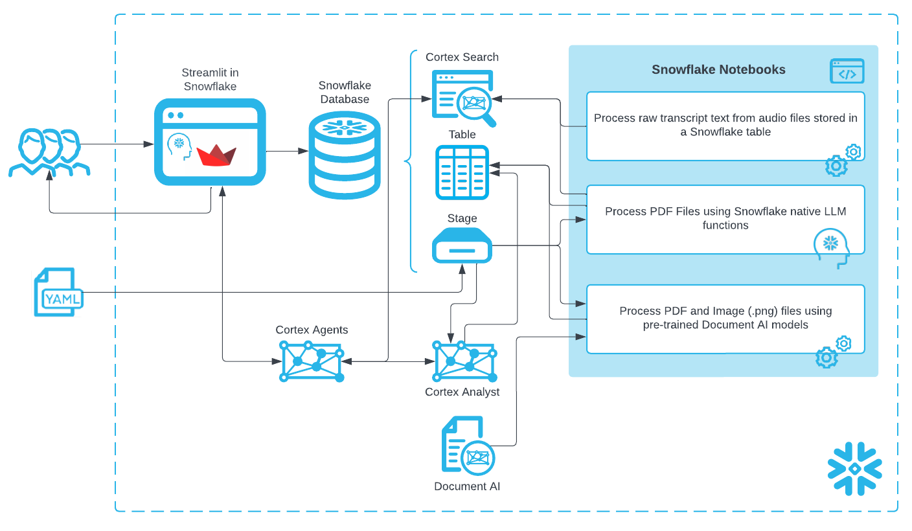

# <h0black>Build an AI Assistant for Telecommunications using </h0black><h0blue>Cortex and Document AI</h0blue>

<h1sub>Using AI to Optimize Network Operations and Customer Experience</h1sub>

<h1sub>Why are we here?</h1sub>

To learn how you can leverage the latest AI technologies right within the Snowflake platform for telecommunications operations. When AI is deeply embedded in your trusted data platform, the possibilities for network optimization, customer insights, and operational efficiency are endless. We will be exploring the processing of both **Unstructured** and **Structured** data which will then allow the application of a **Cortex Agent** to help discover insights from **Network Performance**, **Customer Usage**, and **Operational Data**.

<h1sub> The lab environment</h1sub>

A complete lab environment has been built for you automatically. This includes:

- **Snowflake Account**: [{{ getenv("DATAOPS_SNOWFLAKE_ACCOUNT","[unknown]") }}](https://{{ getenv("DATAOPS_SNOWFLAKE_ACCOUNT","[unknown]") }}.snowflakecomputing.com)
- **User**: {{ getenv("EVENT_USER_NAME","[unknown]") }}
- **Snowflake Virtual Warehouse**: {{ getenv("EVENT_WAREHOUSE","[unknown]") }}
- **Snowflake Database**: {{ getenv("DATAOPS_DATABASE","[unknown]") }}
- **Schema**: {{ getenv("EVENT_SCHEMA","[unknown]") }}

<h1sub>Structure of the Session</h1sub>

You will be taken through the AI capabilities of Snowflake with Telecommunications data. You will be focusing on **Network Performance Analysis**, **Customer Usage Optimization**, and **Operational Intelligence** to improve service quality and customer satisfaction.

Please note that the network data and reports for this lab are completely simulated and are for demonstration purposes only.

<h1sub>Order of the Lab</h1sub>

-    **Network Performance Data Processing** - Analyze real-time network metrics and performance indicators

-    **Customer Usage Analytics** - Process customer data for insights and service optimization  

-    **Incident & Document Processing** - Handle network reports and operational documentation

-    **Cortex Agent** - An AI assistant to query both Network Operations and Customer data

-    Navigate through the lab via the side-bar menu

<h1sub>HAVE FUN</h1sub>

- Navigate to [the lab steps](Logging_in.md) to begin the lab.

!!! warning "This lab environment will disappear!"

    This event is due to end at {{ getenv("EVENT_DECOMMISSION_DATETIME","[unknown time]") }}, at which point access will be restricted, and accounts will be removed.

