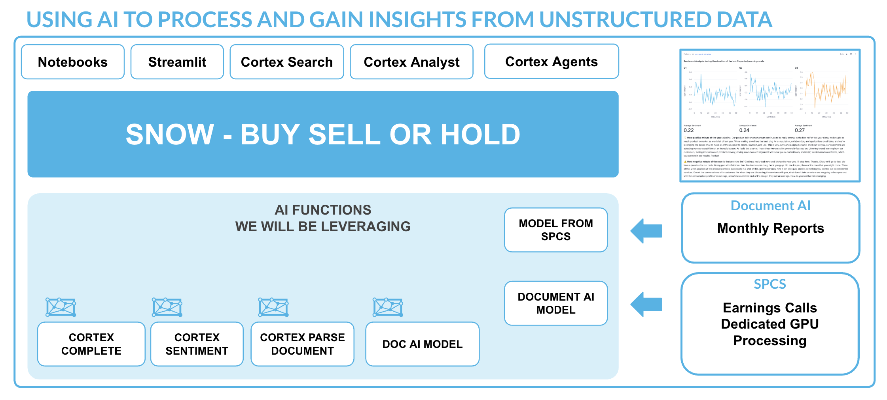

# {{ getenv("EVENT_NAME","[unknown event]") }} - Snowflake Accelerating with AI Hands on Lab

## Why are we here?

To learn about you can leverage the latest AI technologies right within the Snowflake platform.  When AI is deeply embedded in your trusted data platform, the possibilities are endless. We will be exploring the processing of both **Unstructured** and **Structured** data which will then allow the application of a **Cortex Agent** to help descover insights by leveraging **All Data.**

## The lab environment

A complete lab environment has been built for you automatically. This includes:

- **Snowflake Account**: [{{ getenv("DATAOPS_SNOWFLAKE_ACCOUNT","[unknown]") }}](https://{{ getenv("DATAOPS_SNOWFLAKE_ACCOUNT","[unknown]") }}.snowflakecomputing.com)
- **User**: {{ getenv("EVENT_USER_NAME","[unknown]") }}
- **Snowflake Virtual Warehouse**: {{ getenv("EVENT_WAREHOUSE","[unknown]") }}
- **Snowflake Database**: {{ getenv("DATAOPS_DATABASE","[unknown]") }}
- **Schema**: {{ getenv("EVENT_SCHEMA","[unknown]") }}

## Structure of the session

You will be taken through the AI capabilities of Snowflake with Financial Reporting data.  We will be focusing on the Snowflake Share price - and will investigating whether we should **BUY**, **SELL** or **HOLD**

Please note that the Analyst reports for this lab are completely fictious and financial decisions can not be made based on any of the outcomes of this lab.

### Order of the Lab

-    Unstructured Data Processing

-    Structured Data Processing

-    Cortex Agent - an application to query both Unstructured and Structured Data

-    Navigate through the lab via the side-bar menu

**Have Fun**

!!! warning "This lab environment will disappear!"

    This event is due to end at {{ getenv("EVENT_END_DATETIME","[unknown time]") }}, at which point access will be restricted, and accounts will be removed.

