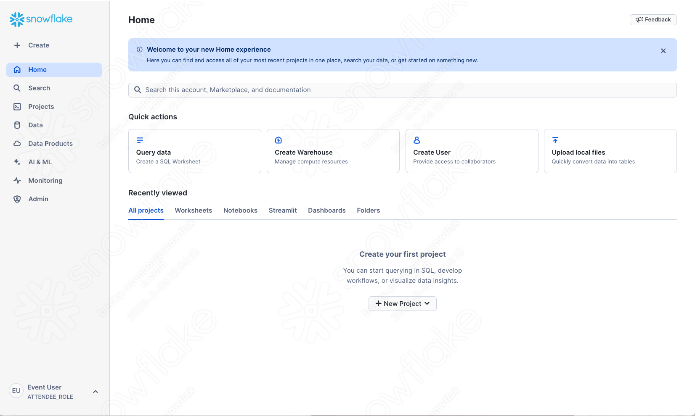

# 1 - Logging in and ready to build

Within the previous screen, you should have logged into snowflake which would have opened up in a new tab and should look like this:

If you cannot find the snowflake URL, you can go back to the registration page and view your unique Snowflake link by clicking here: [Personalized Event Homepage](https://go.dataops.live/{{ getenv("EVENT_SLUG") }}){target="\_blank"}

Upon logging in, you may be prompted to add your email address.  It is important to input your email address for accessing market place data.  You will be accessing marketplace data in this lab.

Once you have logged in, populated your email address and closed down any welcome messages, proceed to step 2 - **Get Data from the Market Place**.  This is where you will get structured financial data open to the public.

