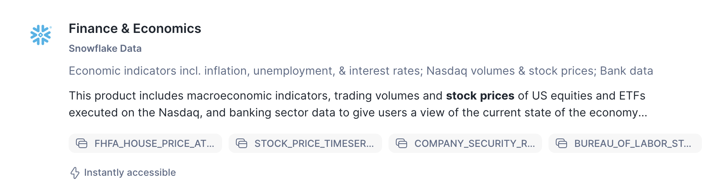

# 2 - Get Data from the marketplace

Firstly, it would be good to get some data from the marketplace to understand the latest stock prices of **Snowflake Shares**.

- In the Home page, go to **Data Products** and then **Marketplace**.
- In the Search Menu, type in **share prices snowflake**.
- click on the **Finance & Economics** dataset.

This dataset is structured in nature - but updates on a daily basis.

- Press **Get** to get the data.  You will be prompted to type in your email address if you have not already completed your profile.

- Press **Done**

- We will use this dataset later in the lab.  Let's now gather some unstructured datasets

- Navigate to Step 3 - Document AI