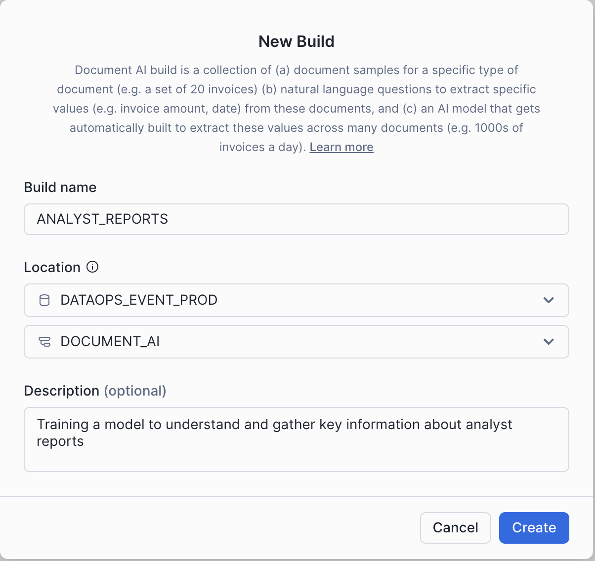
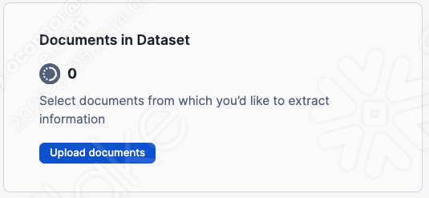
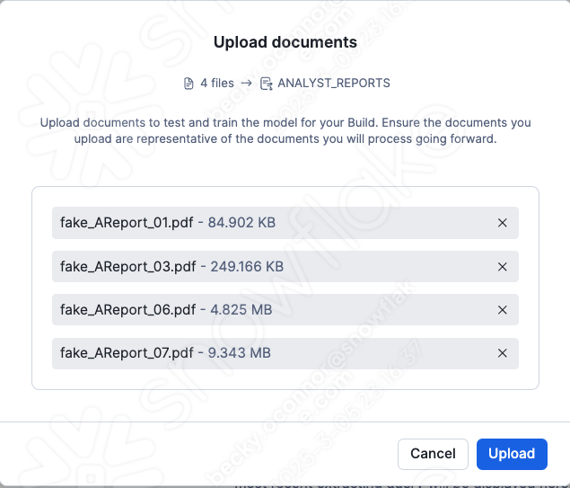
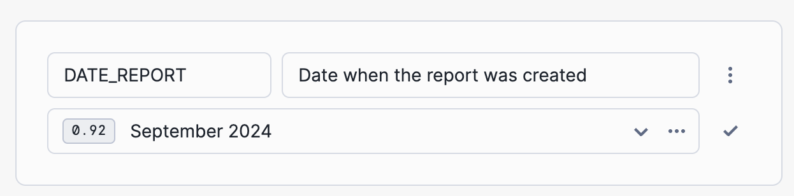
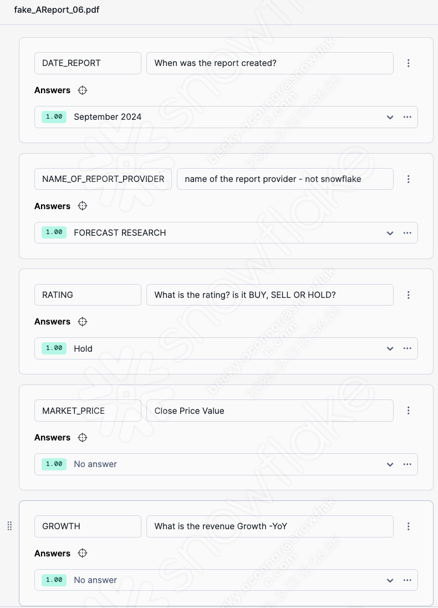
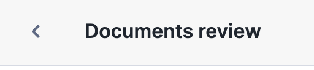

# 2 - Document AI

In this section you will learn how to build and train a Document AI which will enable you to extract important structured content out of unstructured documents.

- Within the AI & ML area, click on Document AI:

    

- Click on the + Build icon to build a new model

    

- Under Build name, type in **SNOWFLAKE_INFOGRAPHICS**

- Choose the **DATAOPS_EVENT_PROD** for the database and **DOCUMENT_AI** for the Schema

Press Create

### Downloading Documents

We now need upload some documents into Document AI in order to build a train model.  The first Model we will build are analyst reports.  The reports we we will be using are completely fictional.

- **Download** The Analyst Reports **<a href="downloads/fake_docs.zip" download>here</a>**

The Second model we will build are consistant infographic style reports.  These are quartely publically available snowflake reports.

- **Download** the Infographics **<a href="downloads/infographics.zip" download> here</a>**

### Uploading the Documents to the model
- Unzip the Analyst reports to a file location which you can access
- Open the model which you have just created and press upload documents

You will see that you can upload a variety of formats.  Today we will be uploading PDF documents.  You can either select the files by searching in your file system **or** drag and drop.

Press **Upload**

You will see that 4 documents are now uploaded but need attention.  To use the model, you will first need to decide which fields you would like to extract.  A warning will also let you know that for better accuracy you should really train the model with more documents.  For this excercise we will just use 4 but in reality you will need to train the model with at least 10 documents for good accuracy.

### Review Documents and Extract Fields

- With in the Documents in Dataset section, press **See all documents**

You willl see that all 4 documents are in need of review

- Click on the first document in the list.  This will take you straight to the Analyst Report.  The right hand side of the screen you will need to add the fields that you wish to extract.  We will be extracting specific fields.

- Press **+ Value** to add a new field

- Enter **DATE_REPORT** in the first field and in the second field, as the question **When was the Report Created?**

Document AI will search through the multi page document and then will give you an answer with a probability score

- If you are happy with the answer, mark it with the **tick**.  When the press the tick, the probability score will change to 1.00 - In otherwords, you have told document AI that you are 100% sure that this answer is correct.

- Create 4 additional fields with the corresponding questions - If document AI get's the answer right, mark with a tick. press **+ Value** to create each field.

| Field    | Question |
| -------- | -------  |
| NAME_OF_REPORT_PROVIDER | name of the report provider   |
| RATING | What is the rating? is it BUY, SELL OR HOLD?     |
| MARKET_PRICE    | Close Price Value    |
| GROWTH   | What is the revenue Growth    |

If the answer is wrong, overtype the answer with the correct answer.  This will automatically mark it as correct with the new answer.

Sometimes document AI comes up with no answer at all.  If this is correct, still mark with a tick.

When you have finished entering the questions and getting the answers you should see something that looks like this:

Now it's time to evaluate the same questions and answers with another document.

- Click on the arrow to review on the bottom right of this pane the next document.  Currently you are reviewing 1 of 4 documents.

The next document may populate more of the answers.  You will need to simply mark them as to whether they are correct or not.  If any are incorrect, type over with the correct answer.

- When you have finished reviewing 2 of 4 documents, continue to review the final 2 documents. 

Once you have completed your document review press the back button on the top left to go back to the previous screen

All 4 documents should now be marked as **Accepted**. 

- Go back to Build Details

You will see that there is a model accuracy.  This accuracy figure will be due to how many answers document ai initially predicted correctly or not.  If the accuracy score is low, you may wish to **Train model** this will train the model with the **corrected answers**.

- Press Train Model then **start training**.  This can take some time - especially if you are training large documents of multiple pages.

